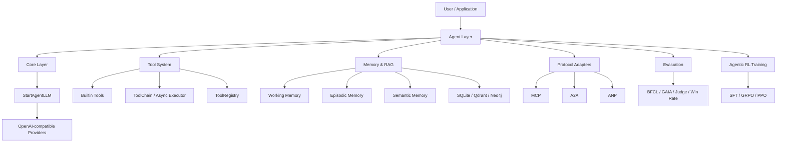
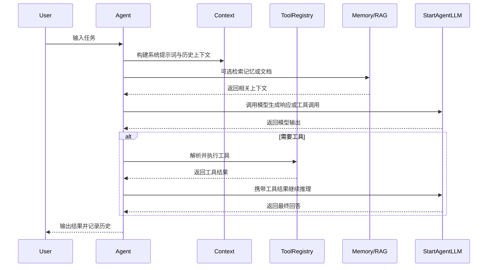
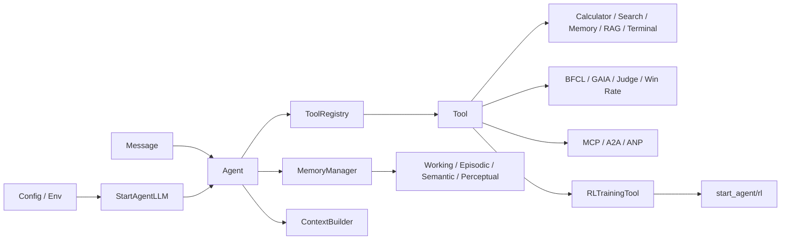
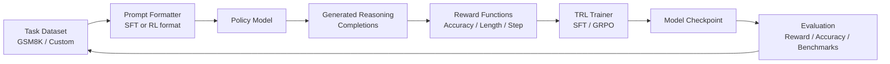
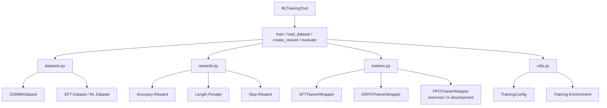

# StartAgent

[](https://pypi.org/project/start-agent/)
[](https://pypi.org/project/start-agent/)
[](LICENSE)

StartAgent 是一个灵活、可扩展的多智能体框架，基于 OpenAI 兼容接口构建，面向 Agent 开发、工具调用、记忆管理、协议适配、自动评测和强化学习训练等场景。

当前版本为 `1.0.0`。

## 安装

从 PyPI 安装稳定版本：

```bash
pip install start-agent
```

按需安装扩展能力：

```bash
pip install "start-agent[search]"
pip install "start-agent[memory]"
pip install "start-agent[protocols]"
pip install "start-agent[rl]"
```

一次性安装常用扩展：

```bash
pip install "start-agent[all]"
```

从源码开发：

```bash
git clone https://github.com/ltq525/Start-Agent.git
cd Start-Agent
python -m venv .venv
source .venv/bin/activate
python -m pip install --upgrade pip
pip install -r requirements.txt
pip install -e ".[dev]"
```

安装后使用 `start_agent` 作为 Python 导入名。

## 核心能力

- **多 Agent 范式**：提供 `SimpleAgent`、`ReActAgent`、`ReflectionAgent`、`PlanAndSolveAgent`、`ToolAwareSimpleAgent`、`FunctionCallAgent`。
- **统一 LLM 接口**：通过 `StartAgentLLM` 调用 OpenAI、DeepSeek、通义千问、ModelScope、Kimi、智谱、Ollama、vLLM、本地或自定义 OpenAI 兼容服务。
- **工具系统**：支持工具注册、函数工具、工具链、异步执行，以及计算器、搜索、记忆、RAG、终端、评测和协议工具。
- **记忆与 RAG**：包含工作记忆、情节记忆、语义记忆、感知记忆，支持 SQLite、Qdrant、Neo4j 等存储扩展。
- **协议适配**：包含 MCP、A2A、ANP 等协议相关实现。
- **评测与数据生成**：支持 BFCL、GAIA、LLM Judge、Win Rate 等评测流程。
- **Agentic RL**：围绕 TRL 提供 SFT、GRPO、PPO 训练包装、GSM8K 数据集处理、奖励函数和 `RLTrainingTool`，用于优化模型的推理与任务完成能力。

## 工程架构



## 请求流程



## 项目结构

```text
start_agent/
  agents/        Agent 实现
  core/          LLM、配置、消息和异常等核心组件
  tools/         工具基类、注册表、内置工具和工具执行器
  memory/        记忆系统、RAG 管线和存储后端
  protocols/     MCP、A2A、ANP 协议适配
  evaluation/    BFCL、GAIA、数据生成和自动评测
  rl/            强化学习训练、数据集和奖励函数
  context/       上下文构建工具
  utils/         日志、序列化和辅助函数
tests/           基础烟测
.env.example     环境变量示例
ENVIRONMENT.md   环境配置导向
pyproject.toml   Python 包与可选依赖配置
requirements.txt 基础运行依赖清单
```

## 模块文档

- [记忆系统](start_agent/memory/README.md)
- [上下文工程](start_agent/context/README.md)
- [评估模块](start_agent/evaluation/README.md)
- [协议模块](start_agent/protocols/README.md)
- [强化学习模块](start_agent/rl/README.md)

## 模块关系



## Agentic RL

Agentic RL 模块位于 `start_agent/rl/`，目标是把 Agent 的推理、行动和评测信号转化为可训练的模型优化流程。当前工程实现主要围绕数学推理任务和 TRL 训练器展开，适合用于小模型 SFT 热身、GRPO 奖励优化，以及后续扩展到工具调用轨迹、环境反馈和多步任务奖励。



### RL 模块结构



### 训练范式

| 阶段 | 入口 | 作用 |
| --- | --- | --- |
| SFT | `SFTTrainerWrapper` | 让模型学习指令跟随、基础格式和推理书写方式 |
| GRPO | `GRPOTrainerWrapper` | 使用奖励函数优化生成结果，适合数学推理和无需 Value Model 的 RL 训练 |
| PPO | `PPOTrainerWrapper` | 预留经典 PPO 训练接口，当前实现提示优先使用 GRPO |
| 奖励函数 | `create_accuracy_reward`、`create_length_penalty_reward`、`create_step_reward` | 基于答案正确性、输出长度和推理步骤构造奖励 |
| 工具入口 | `RLTrainingTool` | 通过工具参数触发数据加载、奖励函数创建、训练和评估 |

### 使用示例

通过工具接口加载一个小样本数据集：

```python
from start_agent.tools.builtin.rl_training_tool import RLTrainingTool

tool = RLTrainingTool()
print(tool.run({
    "action": "load_dataset",
    "format": "sft",
    "split": "train",
    "max_samples": 8,
}))
```

创建奖励函数并启动一次小规模 GRPO 训练：

```python
from start_agent.tools.builtin.rl_training_tool import RLTrainingTool

tool = RLTrainingTool()
print(tool.run({
    "action": "train",
    "algorithm": "grpo",
    "model_name": "Qwen/Qwen2-0.5B-Instruct",
    "dataset": "gsm8k",
    "max_samples": 32,
    "num_epochs": 1,
    "batch_size": 2,
    "output_dir": "./output/grpo-demo",
    "use_tensorboard": True,
}))
```

> Agentic RL 相关代码会加载 Hugging Face 数据集和模型，通常需要额外安装 `datasets`、`transformers`、`trl`，并准备可用的 GPU 或较小的本地实验配置。

## 环境要求

- Python 3.10+
- 推荐使用虚拟环境

完整环境配置请参考 [ENVIRONMENT.md](ENVIRONMENT.md)。如果使用源码开发，基础安装方式：

```bash
python -m venv .venv
source .venv/bin/activate
python -m pip install --upgrade pip
pip install -r requirements.txt
pip install -e ".[dev]"
```

如果使用源码开发并需要记忆、搜索、协议或 RL 模块，可以按需安装 extras：

```bash
pip install -e ".[search]"
pip install -e ".[memory]"
pip install -e ".[protocols]"
pip install -e ".[rl]"
```

也可以一次性安装常用扩展：

```bash
pip install -e ".[all]"
```

> 说明：不同模块依赖不同，建议按实际使用的能力分批安装依赖。详细的场景依赖、环境变量和安全注意事项见 [ENVIRONMENT.md](ENVIRONMENT.md)。

## 配置

StartAgent 会优先读取构造参数，其次读取环境变量。可以从示例文件开始：

```bash
cp .env.example .env
```

常用变量如下：

```bash
export LLM_API_KEY="your-api-key"
export LLM_BASE_URL="https://api.openai.com/v1"
export LLM_MODEL_ID="gpt-3.5-turbo"
export LLM_PROVIDER="custom"
export LLM_TIMEOUT="60"
```

也可以使用特定服务商变量：

```bash
export OPENAI_API_KEY="..."
export DEEPSEEK_API_KEY="..."
export DASHSCOPE_API_KEY="..."
export MODELSCOPE_API_KEY="..."
export KIMI_API_KEY="..."
export ZHIPU_API_KEY="..."
export OLLAMA_HOST="http://localhost:11434/v1"
```

搜索工具可选变量：

```bash
export TAVILY_API_KEY="..."
export SERPAPI_API_KEY="..."
export PERPLEXITY_API_KEY="..."
```

请不要将 `.env` 或任何 API Key 提交到公开仓库。

更多 LLM、搜索、Qdrant、Neo4j、Embedding、Agentic RL 和 GitHub Token 配置请参考 [ENVIRONMENT.md](ENVIRONMENT.md)。

## 快速开始

### 运行基础工具

计算器工具不依赖外部服务，适合用来确认本地包导入正常：

```python
from start_agent.tools.builtin.calculator import calculate

print(calculate("sqrt(16) + 2 * 3"))
```

### 调用 LLM

```python
from start_agent import StartAgentLLM, SimpleAgent

llm = StartAgentLLM(
    provider="openai",
    model="gpt-3.5-turbo",
)

agent = SimpleAgent(
    name="assistant",
    llm=llm,
    system_prompt="你是一个简洁、可靠的 AI 助手。",
)

print(agent.run("用一句话介绍 StartAgent。"))
```

### 注册工具

```python
from start_agent import StartAgentLLM, ReActAgent, ToolRegistry

registry = ToolRegistry()
registry.register_function(
    name="echo",
    description="原样返回输入内容",
    func=lambda text: text,
)

llm = StartAgentLLM(provider="openai")
agent = ReActAgent(name="react-agent", llm=llm, tool_registry=registry)

print(agent.run("请调用 echo 工具返回 hello"))
```

## 常见扩展点

| 需求 | 推荐入口 | 说明 |
| --- | --- | --- |
| 新增 Agent 范式 | `start_agent/agents/` | 继承核心 `Agent`，实现自己的 `run` 流程 |
| 新增工具 | `start_agent/tools/base.py` | 继承 `Tool`，实现 `run` 和 `get_parameters` |
| 注册函数工具 | `ToolRegistry.register_function` | 适合轻量函数、实验脚本和 demo |
| 接入新模型服务 | `StartAgentLLM` 参数或环境变量 | 只要服务兼容 OpenAI Chat Completions 即可接入 |
| 增加记忆后端 | `start_agent/memory/storage/` | 可扩展文档、向量或图存储 |
| 增加评测流程 | `start_agent/evaluation/benchmarks/` | 可复用现有数据集、指标和 evaluator 模式 |

## 测试

```bash
pytest
```

当前 demo 测试位于 `tests/test_start_agent_demo.py`，覆盖：

- `CalculatorTool` 和 `calculate`
- `ToolRegistry` 注册函数工具
- 使用 `FakeLLM` 运行 `SimpleAgent`，不触发真实模型 API

## 开发说明

- `StartAgentLLM` 封装任何 OpenAI 兼容的 Chat Completions 服务。
- `ToolRegistry` 负责注册、查找和执行工具。
- 内置搜索工具支持 Tavily、SerpApi、DuckDuckGo、SearXNG、Perplexity 等后端，其中部分后端需要额外依赖和 API Key。
- 记忆和 RAG 模块可能使用 SQLite、Qdrant、Neo4j、NumPy、嵌入模型等组件，请按实际功能安装依赖。
- Agentic RL 模块依赖 Hugging Face、Transformers、TRL 和 PyTorch 生态，建议单独隔离环境，并从小样本、小模型开始验证。
- `.env.example` 只保留变量名和占位符，真实 `.env` 会被 `.gitignore` 忽略。

## 声明

本项目按现状提供，示例代码和工具调用结果仅用于学习、研究和工程实验。使用第三方模型、搜索服务、向量数据库或评测数据集时，请遵守对应服务商、数据集和开源组件的许可协议、使用条款及隐私要求。

## 补充说明

本项目是对 GitHub 上 `hello-agents` 使用时常见 bug 的完整性修复。

## Reference Links

1. [Datawhalechina/hello-agents](https://github.com/datawhalechina/hello-agents)
2. [Claude-code-from-scratch](https://github.com/Windy3f3f3f3f/claude-code-from-scratch)

## 许可证

本项目采用 MIT License 开源。详见 [LICENSE](LICENSE)。
