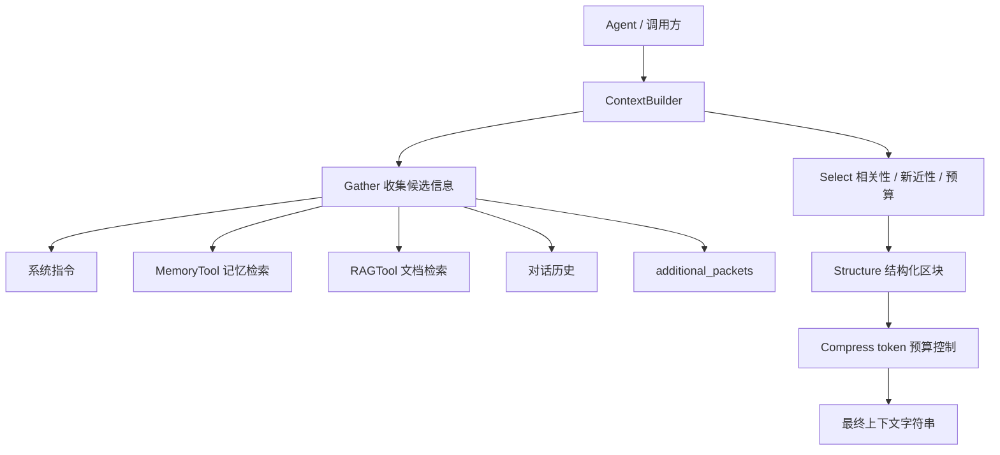

# StartAgent 上下文工程模块

`start_agent.context` 是 StartAgent 的上下文构建层。它负责把系统指令、当前问题、对话历史、记忆检索结果、RAG 证据和额外工具结果组织成可直接交给模型的结构化上下文。

当前实现的核心是 `ContextBuilder`，采用 GSSC 流程：

1. `Gather`：从多源收集候选上下文包。
2. `Select`：按照相关性、新近性和 token 预算筛选。
3. `Structure`：把选中的信息组织成固定区块。
4. `Compress`：当上下文超过预算时做压缩或截断。

## 结构



## 核心文件

- `builder.py`：实现 `ContextPacket`、`ContextConfig`、`ContextBuilder` 和 `count_tokens()`。
- `__init__.py`：导出上下文工程的主要公开接口。

## 数据模型

### ContextPacket

`ContextPacket` 是上下文构建过程中的候选信息包：

```python
@dataclass
class ContextPacket:
    content: str
    timestamp: datetime
    metadata: Dict[str, Any]
    token_count: int
    relevance_score: float
```

常见 `metadata["type"]` 包括：

- `instructions`：系统指令和强约束。
- `task_state`：任务状态、关键结论、阻塞信息。
- `related_memory`：与当前查询相关的记忆。
- `knowledge_base`：RAG 检索出的外部知识。
- `history`：最近对话历史。
- `retrieval` / `tool_result`：调用方手动传入的检索或工具结果。

### ContextConfig

`ContextConfig` 控制上下文构建策略：

- `max_tokens`：上下文总 token 预算。
- `reserve_ratio`：为模型生成预留的比例。
- `min_relevance`：非系统信息进入上下文的最低相关性。
- `enable_mmr` / `mmr_lambda`：为后续 MMR 多样性选择预留的配置项。
- `system_prompt_template`：系统提示模板预留字段。
- `enable_compression`：是否启用超预算压缩。

`get_available_tokens()` 会用 `max_tokens * (1 - reserve_ratio)` 计算实际可用预算。

## 构建流程

### Gather

`_gather()` 会按优先级收集信息：

1. 系统指令会被标记为 `instructions`，作为最高优先级信息。
2. 如果传入 `MemoryTool`，会先检索任务状态类记忆，再检索与当前查询相关的记忆。
3. 如果传入 `RAGTool`，会用当前查询检索知识库证据。
4. 对话历史只保留最近 10 条，作为辅助背景。
5. 调用方可以通过 `additional_packets` 注入额外上下文。

记忆或 RAG 检索失败时，当前实现会打印警告并继续构建，不会中断整个流程。

### Select

`_select()` 负责筛选上下文包：

- 使用简单的关键词重叠计算 `relevance_score`。
- 使用指数衰减计算新近性。
- 用 `0.7 * relevance + 0.3 * recency` 作为排序分数。
- `instructions` 类型会单独保留，不参与最低相关性过滤。
- 其余信息需要满足 `min_relevance`，并且不能超过可用 token 预算。

当前 `enable_mmr` 配置尚未真正接入选择逻辑，后续可以在这一层加入最大边际相关性去重。

### Structure

`_structure()` 会把选中的 packet 组织成固定区块：

- `[Role & Policies]`：系统角色和策略。
- `[Task]`：当前用户问题。
- `[State]`：任务状态和未决问题。
- `[Evidence]`：记忆、知识库、检索和工具证据。
- `[Context]`：对话历史与背景材料。
- `[Output]`：默认输出格式约束。

这个结构适合给 Agent 主循环使用，也方便后续做日志、观测和调试。

### Compress

`_compress()` 会检查最终上下文是否超过可用 token 预算。

当前压缩策略比较轻量：如果超预算，就按行保留前面的内容直到达到预算上限。注释中已经预留了更高保真 LLM 摘要压缩的方向。

## 使用示例

```python
from start_agent.context import ContextBuilder, ContextConfig, ContextPacket

builder = ContextBuilder(
    memory_tool=memory_tool,
    rag_tool=rag_tool,
    config=ContextConfig(max_tokens=8000, reserve_ratio=0.15),
)

context = builder.build(
    user_query="总结当前任务进展",
    conversation_history=messages,
    system_instructions="你是一个严谨的工程助手。",
    additional_packets=[
        ContextPacket(
            content="最近一次测试通过了核心单元测试。",
            metadata={"type": "tool_result"},
        )
    ],
)
```

如果只需要本地拼装上下文，可以不传 `memory_tool` 和 `rag_tool`，只使用系统指令、历史和额外 packet。

## 依赖

- `tiktoken`：用于估算 token 数。失败时 `count_tokens()` 会退化为按字符数粗略估算。
- `MemoryTool`：可选，用于检索 StartAgent 记忆系统。
- `RAGTool`：可选，用于检索外部知识库。

## 当前实现说明

- 相关性计算仍是轻量关键词重叠，不是 embedding 相似度。
- `enable_mmr` 目前是配置预留项，尚未实际执行 MMR 选择。
- 压缩策略是按行截断，适合兜底，不适合需要严格保真摘要的场景。
- `_structure()` 中的 `[Output]` 模板是固定文本；如果不同 Agent 需要不同输出格式，可以后续扩展为配置项。
