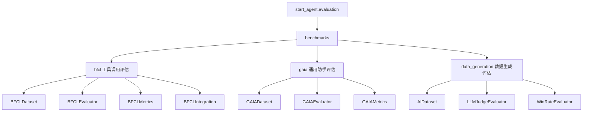

# StartAgent 评估模块

`start_agent.evaluation` 是 StartAgent 的评估层，用来衡量 Agent 的工具调用、通用问题解决和数据生成质量。

当前模块包含三类评估：

- `BFCL`：评估函数调用和工具调用能力。
- `GAIA`：评估通用 AI 助手在真实世界任务上的表现。
- `Data Generation`：评估生成数学题目或训练数据的质量。

## 结构



## 核心文件

- `__init__.py`：导出常用数据集和评估器。
- `benchmarks/bfcl/dataset.py`：加载 BFCL v4 数据和 ground truth。
- `benchmarks/bfcl/evaluator.py`：运行 Agent 工具调用评估。
- `benchmarks/bfcl/metrics.py`：计算准确率、AST 匹配、参数准确率等指标。
- `benchmarks/bfcl/bfcl_integration.py`：对接 BFCL 官方评估工具。
- `benchmarks/gaia/dataset.py`：加载 GAIA 数据集，支持 HuggingFace 和本地 JSON。
- `benchmarks/gaia/evaluator.py`：执行 GAIA 样本评估和答案匹配。
- `benchmarks/gaia/metrics.py`：计算精确匹配、部分匹配和分难度指标。
- `benchmarks/data_generation/dataset.py`：加载 AIME 真题或生成题目。
- `benchmarks/data_generation/llm_judge.py`：用 LLM 评委打分。
- `benchmarks/data_generation/win_rate.py`：通过成对比较计算胜率。

## BFCL 评估

BFCL 面向工具调用能力，主要覆盖：

- 简单函数调用。
- 多函数调用。
- 并行函数调用。
- 无关调用检测。
- 多轮工具调用。
- Live、memory、web search 等扩展类别。

`BFCLDataset` 从 BFCL 数据目录读取 JSONL 测试数据，并从 `possible_answer` 目录读取 ground truth。常见类别包括：

- `simple_python`
- `multiple`
- `parallel`
- `parallel_multiple`
- `irrelevance`
- `live_simple`
- `multi_turn_base`
- `memory`
- `web_search`

`BFCLEvaluator` 会调用 Agent，解析响应中的函数调用，并与 ground truth 比较。当前支持两类模式：

- `ast`：基于函数调用结构和参数的匹配。
- `execution`：预留执行评估入口，当前会退化到 AST 匹配。

示例：

```python
from start_agent.evaluation import BFCLDataset, BFCLEvaluator

dataset = BFCLDataset(category="simple_python")
evaluator = BFCLEvaluator(dataset=dataset, evaluation_mode="ast")
results = evaluator.evaluate(agent, max_samples=20)

print(results["overall_accuracy"])
```

如果需要使用 BFCL 官方工具链，可以通过 `BFCLIntegration` 准备结果文件、运行官方评估并解析 score 文件。

## GAIA 评估

GAIA 面向通用助手任务，强调真实世界问题、推理、文件处理和工具使用。

`GAIADataset` 支持两种数据来源：

- 从 HuggingFace `gaia-benchmark/GAIA` 下载。该数据集需要访问权限和 `HF_TOKEN`。
- 从本地目录读取 JSON 文件，适合离线调试或小样本评估。

难度级别：

- `Level 1`：简单问题。
- `Level 2`：中等问题，需要少量工具或多步推理。
- `Level 3`：复杂问题，需要更长工具链和推理过程。

`GAIAEvaluator` 会构造提示词、调用 `agent.run(prompt)`，然后从响应中提取 `FINAL ANSWER:` 或其他答案标记。指标包括：

- `exact_match_rate`
- `partial_match_rate`
- 按 Level 统计的匹配率
- 执行时间

示例：

```python
from start_agent.evaluation import GAIAEvaluator

evaluator = GAIAEvaluator(level=1, strict_mode=True)
results = evaluator.evaluate(agent, max_samples=10)

print(results["exact_match_rate"])
```

## 数据生成评估

`data_generation` 目前主要服务于 AIME 风格数学题数据质量评估。

### AIDataset

`AIDataset` 支持：

- `dataset_type="generated"`：从本地 JSON 加载生成题目。
- `dataset_type="real"`：从 HuggingFace 下载 AIME 真题数据。

统一后的样本字段包括：

- `problem_id`
- `problem`
- `answer`
- `solution`
- `difficulty`
- `topic`

### LLMJudgeEvaluator

`LLMJudgeEvaluator` 使用 LLM 作为评委，从四个维度给生成题目打分：

- `correctness`
- `clarity`
- `difficulty_match`
- `completeness`

批量评估会输出平均分、通过率和优秀率。

### WinRateEvaluator

`WinRateEvaluator` 把生成题目和参考题目随机配对，请 LLM 判断哪一个质量更高。它会随机打乱题目顺序，降低位置偏置，并统计：

- `win_rate`
- `loss_rate`
- `tie_rate`
- 胜负平数量

## Agent 接口要求

评估器默认假设 Agent 至少提供：

```python
response = agent.run(prompt)
```

其中 `response` 应该是字符串。BFCL 场景下，响应最好包含可解析的函数调用；GAIA 场景下，建议使用：

```text
FINAL ANSWER: ...
```

这样可以减少答案提取误差。

## 依赖和外部数据

- BFCL 官方工具：可选，需要 `bfcl-eval`。
- GAIA HuggingFace 数据：需要 `huggingface_hub` 和 `HF_TOKEN`。
- 数据生成评估：需要可用的 `StartAgentLLM` 和对应模型 API 配置。
- 指标统计：部分指标依赖 `numpy`。

## 当前实现说明

- BFCL 的 `execution` 模式仍是简化实现，尚未提供隔离的安全执行环境。
- GAIA 的答案匹配是本地规则匹配，不能完全等价于官方评测。
- LLM Judge 和 Win Rate 会受评委模型、提示词和随机采样影响，建议固定随机种子并保存原始评估文本。
- 涉及 HuggingFace 或 LLM 的评估通常需要网络和认证配置；离线环境建议使用本地数据和小样本 smoke test。
