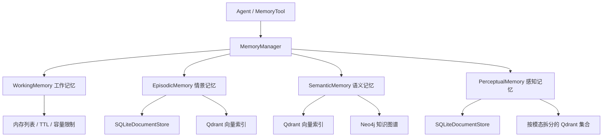

# StartAgent 记忆系统

`start_agent.memory` 是 StartAgent 的记忆层。它采用分层设计：短期上下文放在工作记忆中，长期交互事件放在情景记忆中，事实和知识放在语义记忆中，可选的多模态输入放在感知记忆中。

记忆系统的统一入口是 `MemoryManager`。Agent 通常通过 `MemoryTool` 使用记忆能力，`MemoryTool` 会把添加、检索、遗忘、整合等操作封装成普通工具调用。

## 架构



## 核心文件

- `base.py`：共享数据结构和抽象接口。
- `manager.py`：记忆系统的高层调度器。
- `embedding.py`：统一文本 embedding 提供器和向量维度工具。
- `types/working.py`：短期工作记忆。
- `types/episodic.py`：事件和交互记忆。
- `types/semantic.py`：面向知识的语义记忆，结合向量检索和图谱检索。
- `types/perceptual.py`：可选的多模态感知记忆，支持文本、图像、音频等。
- `storage/document_store.py`：基于 SQLite 的文档和记忆元数据存储。
- `storage/qdrant_store.py`：Qdrant 向量库封装和连接管理器。
- `storage/neo4j_store.py`：Neo4j 图数据库封装。
- `rag/pipeline.py`：文档加载、切块、索引、检索和片段合并工具。

## 数据模型

所有记忆类型都围绕 `MemoryItem` 工作：

```python
class MemoryItem(BaseModel):
    id: str
    content: str
    memory_type: str
    user_id: str
    timestamp: datetime
    importance: float = 0.5
    metadata: Dict[str, Any] = {}
```

所有具体记忆实现都继承 `BaseMemory`，并实现同一组接口：

- `add(memory_item)`
- `retrieve(query, limit, **kwargs)`
- `update(memory_id, content, importance, metadata)`
- `remove(memory_id)`
- `has_memory(memory_id)`
- `clear()`
- `get_stats()`

这套统一接口让 `MemoryManager` 可以在不同记忆类型之间转发操作，而不需要关心每个实现内部使用的是内存、SQLite、Qdrant 还是 Neo4j。

## 记忆类型

### 工作记忆

`WorkingMemory` 是短期上下文记忆，用来保存当前会话中仍然活跃的信息。

它只存放在进程内存里，适合保存最近几轮对话、临时任务状态和短期偏好。它会执行以下限制：

- 记忆条数上限，由 `working_memory_capacity` 配置；
- 近似 token 上限，由 `working_memory_tokens` 配置；
- TTL 过期清理，由 `working_memory_ttl_minutes` 配置；
- 基于重要性和时间衰减的低优先级淘汰。

检索时会优先尝试轻量 TF-IDF 相似度检索；如果 scikit-learn 不可用或检索失败，则退化为关键词匹配。最终排序会结合相关性、时间衰减和重要性。

### 情景记忆

`EpisodicMemory` 用来保存具体事件和交互经历，例如一次对话、一轮任务执行、某个 session 中发生的事情。

它同时维护内存缓存和持久化存储：

- SQLite 作为权威记录库；
- Qdrant 作为语义向量检索索引；
- 内存中的 `episodes` 和 `sessions` 用于快速访问和 session 组织。

常见 metadata 包括：

- `session_id`
- `context`
- `outcome`
- `participants`
- `tags`

检索时会综合向量相似度、新近度和重要性。如果 Qdrant 检索不可用，会退化到内存中的关键词匹配。

### 语义记忆

`SemanticMemory` 用来保存知识型记忆，例如事实、概念、规则、长期偏好和可复用经验。

它的设计比工作记忆和情景记忆更重：

- 使用统一 embedding provider 对文本生成向量；
- 将向量写入 Qdrant；
- 尝试抽取实体和关系；
- 将实体和关系写入 Neo4j 知识图谱；
- 检索时融合向量检索和图谱检索结果。

语义记忆的检索通常分为三步：

1. 在 Qdrant 中做向量相似度检索。
2. 在 Neo4j 中做实体和关系相关搜索。
3. 合并两路结果，根据向量分数、图谱分数和重要性进行排序。

这是当前记忆系统中依赖最重的一层，需要正确配置 embedding、Qdrant、Neo4j，并可选安装 spaCy 等 NLP 依赖。

### 感知记忆

`PerceptualMemory` 是可选的多模态记忆层，用于保存文本、图像、音频等感知输入。

默认支持的模态由 `perceptual_memory_modalities` 配置，通常包括：

- `text`
- `image`
- `audio`
- `video`

编码策略如下：

- 文本：使用统一文本 embedding。
- 图像：优先使用 CLIP；不可用时退化为确定性哈希向量。
- 音频：优先使用 CLAP；不可用时退化为确定性哈希向量。
- 其他数据：尽量转成文本 embedding，失败后使用哈希向量。

感知记忆会将元数据写入 SQLite，并按模态拆分 Qdrant collection，避免不同模态向量维度不一致导致冲突。

## MemoryManager 流程

`MemoryManager` 负责记忆生命周期和跨类型协调。

### 添加记忆

`add_memory()` 会创建 `MemoryItem`，生成 ID 和时间戳，按需计算重要性，并根据 `memory_type` 分发给对应的记忆实现。

如果启用 `auto_classify`，管理器会根据简单关键词规则自动判断记忆类型。为了行为稳定，工具或业务代码通常建议显式传入 `memory_type`，并设置 `auto_classify=False`。

### 检索记忆

`retrieve_memories()` 会查询一个或多个启用的记忆类型，收集结果后排序并返回。

注意：每种记忆类型内部都有自己的检索策略。`MemoryManager` 只负责协调和合并，不负责统一计算所有相关性分数。

### 更新和删除

`update_memory()` 和 `remove_memory()` 会遍历所有启用的记忆类型，根据 `memory_id` 找到所属记忆实例，然后委托给该实例执行更新或删除。

### 遗忘

`forget_memories()` 支持三种策略：

- `importance_based`：删除重要性低于阈值的记忆。
- `time_based`：删除超过 `max_age_days` 的旧记忆。
- `capacity_based`：当容量超限时删除低优先级记忆。

当前长期记忆实现主要采用硬删除，而不是软删除标记。

### 整合

`consolidate_memories()` 用于把重要短期记忆提升为长期记忆。最常见路径是：

```text
working -> episodic
```

默认只有重要性不低于 `0.7` 的记忆会被整合。

## 工具集成

`MemoryTool` 位于 `start_agent.tools.builtin.memory_tool`，它把 `MemoryManager` 封装成 Agent 可调用的工具。

支持的操作包括：

- `add`：添加记忆；
- `search`：检索记忆；
- `summary`：获取记忆摘要；
- `stats`：获取统计信息；
- `update`：更新记忆；
- `remove`：删除记忆；
- `forget`：按策略遗忘记忆；
- `consolidate`：整合短期记忆到长期记忆；
- `clear_all`：清空所有记忆。

示例：

```python
from start_agent.tools.builtin.memory_tool import MemoryTool

tool = MemoryTool(memory_types=["working", "episodic"])

print(tool.run({
    "action": "add",
    "content": "用户偏好简洁回答。",
    "memory_type": "working",
    "importance": 0.8,
}))

print(tool.run({
    "action": "search",
    "query": "回答风格偏好",
    "limit": 3,
}))
```

`MemoryTool.auto_record_conversation()` 可以自动记录对话。普通对话会写入工作记忆；如果回复较长，或者用户输入里包含“重要”“记住”等关键词，则会额外写入情景记忆。

## RAG 与记忆系统的关系

`rag/` 包和四类 memory type 是相邻关系，不是 `MemoryManager` 默认管理的一种记忆类型。

RAG 主要面向外部文档：

1. 加载文件；
2. 将 PDF、Office、Markdown、文本等格式转换为 markdown-like 文本；
3. 切分 chunk；
4. 生成 embedding；
5. 写入 Qdrant；
6. 检索、重排并合并相关片段。

简单区分：

- 用 `MemoryManager` 管理 Agent 自身的对话记忆、事件记忆和知识记忆。
- 用 `rag/pipeline.py` 处理外部文档知识库和文档问答。

## 配置

常用环境变量包括：

- `QDRANT_URL`
- `QDRANT_API_KEY`
- `QDRANT_COLLECTION`
- `QDRANT_DISTANCE`
- `NEO4J_URI`
- `NEO4J_USERNAME`
- `NEO4J_PASSWORD`
- `NEO4J_DATABASE`
- `EMBED_MODEL_TYPE`
- `EMBED_MODEL_NAME`
- `EMBED_API_KEY`
- `EMBED_BASE_URL`
- `EMBED_DIMENSION`

轻量本地开发时，建议只启用 `working`，或启用 `working + episodic`。`semantic` 和 `perceptual` 需要更多外部服务和可选依赖，更适合完整环境下使用。

## 当前实现说明

- `WorkingMemory` 最轻量，也最容易独立运行。
- `EpisodicMemory` 已经有比较明确的 SQLite + Qdrant 设计，并且在向量索引失败时可以部分退化。
- `SemanticMemory` 功能更强，但依赖 Qdrant、Neo4j 和 embedding 配置。
- `PerceptualMemory` 仍偏实验性质，CLIP/CLAP 不可用时会使用确定性哈希向量兜底。
- 部分模块仍然直接使用 `print()` 输出，后续可以逐步改为结构化 logging。
- 仓库中部分中文注释在某些终端里可能显示为乱码，但 Python 语法检查可以通过。

