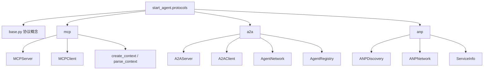

# StartAgent 协议模块

`start_agent.protocols` 封装 StartAgent 与外部工具、服务和其他 Agent 通信所需的协议能力。

当前模块包含三类协议：

- `MCP`：Model Context Protocol，用于暴露工具、资源和提示词。
- `A2A`：Agent-to-Agent Protocol，用于 Agent 间 HTTP 通信和技能调用。
- `ANP`：Agent Network Protocol 的概念性实现，用于服务发现和网络路由。

## 结构



## 核心文件

- `base.py`：定义 `ProtocolType` 和概念性 `Protocol` 基类。
- `__init__.py`：聚合导出 MCP、A2A、ANP 的常用接口。
- `mcp/server.py`：基于 `fastmcp` 的 MCP 服务器封装。
- `mcp/client.py`：支持 memory、stdio、HTTP、SSE 的 MCP 客户端封装。
- `mcp/utils.py`：上下文、成功响应和错误响应的辅助函数。
- `a2a/implementation.py`：基于 Flask HTTP API 的 A2A 服务器、客户端和注册表。
- `anp/implementation.py`：服务发现、节点管理和简单路由的概念实现。

## 基础协议概念

`base.py` 中的 `Protocol` 是概念性基类，主要用于文档和兼容，不要求实际协议实现继承。

```python
from start_agent.protocols.base import Protocol, ProtocolType

protocol = Protocol(ProtocolType.MCP, version="1.0.0")
print(protocol.protocol_name)
```

实际使用时应直接使用 `MCPServer`、`MCPClient`、`A2AServer`、`ANPDiscovery` 等具体类。

## MCP

MCP 用于把 Python 函数、资源和提示词暴露给支持 MCP 的客户端。

### MCPServer

`MCPServer` 基于 `fastmcp.FastMCP`，支持：

- `add_tool()`：注册工具函数。
- `add_resource()`：注册资源读取函数。
- `add_prompt()`：注册提示词模板。
- `run()`：以 `stdio`、`http` 或 `sse` 方式运行。

示例：

```python
from start_agent.protocols import MCPServer

server = MCPServer(name="demo-server")

def calculator(expression: str) -> str:
    return str(eval(expression))

server.add_tool(calculator, name="calculator")
server.run(transport="stdio")
```

### MCPClient

`MCPClient` 支持多种服务器来源：

- `FastMCP` 实例：内存传输，适合测试。
- Python 脚本路径：stdio 传输。
- 命令列表：stdio 传输。
- HTTP URL：HTTP 或 SSE 传输。
- 配置字典：高级传输配置。

常用方法：

- `list_tools()`
- `call_tool(tool_name, arguments)`
- `list_resources()`
- `read_resource(uri)`
- `list_prompts()`
- `get_prompt(prompt_name, arguments)`
- `ping()`

示例：

```python
from start_agent.protocols import MCPClient

client = MCPClient("server.py")

async with client:
    tools = await client.list_tools()
    result = await client.call_tool("calculator", {"expression": "2 + 2"})
```

### MCP 工具函数

`mcp/utils.py` 提供轻量数据结构辅助函数：

- `create_context(messages, tools, resources, metadata)`
- `parse_context(context)`
- `create_error_response(error_message, error_code, details)`
- `create_success_response(data, metadata)`

## A2A

A2A 用于 Agent 间 HTTP 通信。当前实现是一个简化包装，服务端使用 Flask 提供 API。

### A2AServer

`A2AServer` 支持注册技能函数，并暴露以下接口：

- `GET /info`：获取 Agent 信息。
- `GET /skills`：列出技能。
- `POST /execute/<skill_name>`：执行指定技能。
- `POST /ask`：通用问答，尝试自动选择技能。
- `GET /health`：健康检查。

示例：

```python
from start_agent.protocols import A2AServer

server = A2AServer(
    name="MathAgent",
    description="A small math agent",
    capabilities={"calculation": True},
)

@server.skill("double")
def double(text: str) -> str:
    return str(int(text) * 2)

server.run(host="127.0.0.1", port=5000)
```

### A2AClient

`A2AClient` 通过 HTTP 调用 A2A 服务：

- `ask(question)`
- `execute_skill(skill_name, text)`
- `get_info()`
- `list_skills()`

`AgentNetwork` 可以维护多个 Agent URL，`AgentRegistry` 可以作为内存注册中心记录 Agent 元数据。

## ANP

ANP 当前是概念性实现，主要用于表达服务发现和 Agent 网络管理的基本能力。

### ServiceInfo

`ServiceInfo` 表示一个可发现服务：

```python
ServiceInfo(
    service_id="agent1",
    service_type="nlp",
    endpoint="http://localhost:8001",
    service_name="NLP Agent",
    capabilities=["text_analysis"],
    metadata={"version": "1.0"},
)
```

### ANPDiscovery

`ANPDiscovery` 是内存服务发现器，支持：

- `register_service(service)`
- `unregister_service(service_id)`
- `discover_services(service_type, filters)`
- `get_service(service_id)`
- `list_all_services()`

`register_service()` 和 `discover_service()` 是便捷函数，可以减少样板代码。

### ANPNetwork

`ANPNetwork` 维护节点和连接关系，支持：

- 添加和移除节点。
- 连接两个节点。
- 简单直接路由和一跳中转路由。
- 广播消息。
- 获取网络统计和节点信息。

它不负责真实网络传输，只返回路由路径或接收节点列表。

## 依赖

- MCP 服务端和客户端需要 `fastmcp`。
- A2A 服务端需要 `flask`，客户端需要 `requests`。
- A2A 官方 SDK 是可选依赖，当前 HTTP 包装器不强制使用完整官方协议对象。
- ANP 当前无强制外部依赖，是内存概念实现。

## 当前实现说明

- `Protocol` 基类不建议作为继承约束使用。
- MCP 是当前最接近实际协议栈的实现，适合工具和资源暴露。
- A2A 当前更像轻量 HTTP Agent API，不完全等同于官方 A2A 协议栈。
- ANP 不进行真实网络通信、认证、加密或负载均衡，只提供服务发现和路由概念模型。
- 多数协议依赖是可选依赖；导入失败时，模块会提供占位类并在实例化时抛出安装提示。
