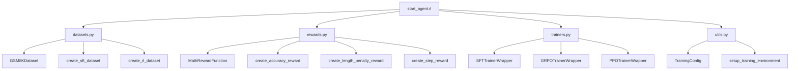

# StartAgent 强化学习模块

`start_agent.rl` 是 StartAgent 的 Agentic RL 训练层，围绕 HuggingFace `transformers`、`datasets` 和 `trl` 封装常见训练流程。

当前模块主要覆盖：

- `SFT`：监督微调，让模型学习指令格式和推理输出。
- `GRPO`：群体相对策略优化，用奖励函数强化推理能力。
- `PPO`：保留接口，当前尚未完整实现。
- 数学推理数据集格式化。
- 数学答案奖励函数。
- 训练配置、环境初始化和设备信息工具。

## 结构



## 核心文件

- `__init__.py`：检查 `trl` 可用性并导出主要训练接口。
- `datasets.py`：加载和格式化 GSM8K 数学推理数据集。
- `rewards.py`：数学答案奖励函数和奖励组合工具。
- `trainers.py`：封装 SFT、GRPO、PPO 训练器。
- `utils.py`：训练配置、环境设置、依赖检查和设备信息。

## 数据集

### GSM8KDataset

`GSM8KDataset` 从 HuggingFace 加载 `openai/gsm8k`，支持两种格式：

- `format_type="sft"`：返回 `prompt`、`completion` 和 `text`。
- `format_type="rl"`：返回 `prompt`、`ground_truth`、`question` 和 `full_answer`。

SFT 格式示例：

```python
{
    "prompt": "Question: ...\n\nLet's solve this step by step:\n",
    "completion": "...\n\nFinal Answer: ...",
    "text": "Question: ...\n\nLet's solve this step by step:\n..."
}
```

RL 格式示例：

```python
{
    "prompt": "...",
    "ground_truth": "42",
    "question": "...",
    "full_answer": "... #### 42"
}
```

如果传入 tokenizer，RL 格式会应用模型的 chat template。

### 便捷函数

- `create_math_dataset()`：创建指定数学数据集，目前支持 `gsm8k`。
- `create_sft_dataset()`：创建 SFT 格式 GSM8K 数据。
- `create_rl_dataset()`：创建 RL 格式 GSM8K 数据，并加载 tokenizer。
- `format_math_dataset()`：把自定义包含 `question` 和 `answer` 字段的数据集转为训练格式。
- `preview_dataset()`：打印少量样本用于检查格式。

## 奖励函数

### MathRewardFunction

`MathRewardFunction` 用于判断数学题生成答案是否正确。

它会尝试从 completion 中提取答案，支持的常见格式包括：

- `Final Answer: ...`
- `#### ...`
- `答案是 ...`
- `Therefore, the answer is ...`
- 最后一行中的数字

然后将预测答案和 `ground_truth` 标准化为数值进行比较；如果不能转为数值，则退化为字符串比较。

### 奖励组合

- `create_accuracy_reward()`：只看答案正确性。
- `create_length_penalty_reward()`：在基础奖励上加入长度惩罚。
- `create_step_reward()`：在基础奖励上加入推理步骤奖励。
- `evaluate_rewards()`：计算平均奖励、最大最小奖励和近似准确率。

示例：

```python
from start_agent.rl import create_accuracy_reward

reward_fn = create_accuracy_reward(tolerance=1e-4)
rewards = reward_fn(
    ["Let's solve it.\nFinal Answer: 2"],
    ground_truth=["2"],
)
```

## 训练配置

`TrainingConfig` 是训练参数的统一入口，常见字段包括：

- `model_name`
- `output_dir`
- `num_train_epochs`
- `per_device_train_batch_size`
- `gradient_accumulation_steps`
- `learning_rate`
- `warmup_steps`
- `logging_steps`
- `save_steps`
- `use_fp16` / `use_bf16`
- `gradient_checkpointing`
- `use_lora` 和 LoRA 参数
- `use_wandb` / `use_tensorboard`
- `seed`
- `max_length`

`setup_training_environment(config)` 会创建输出目录、设置随机种子、关闭 tokenizer 并行警告，并配置 wandb 相关环境变量。

## 训练器

### SFTTrainerWrapper

`SFTTrainerWrapper` 封装 TRL 的 `SFTTrainer`：

1. 检查 TRL 是否安装。
2. 加载 `AutoTokenizer` 和 `AutoModelForCausalLM`。
3. 创建 `SFTConfig`。
4. 添加 `DetailedLoggingCallback` 输出训练进度。
5. 调用 `trainer.train()`。

示例：

```python
from start_agent.rl import TrainingConfig, create_sft_dataset, SFTTrainerWrapper

config = TrainingConfig(
    model_name="Qwen/Qwen3-0.6B",
    output_dir="./output/sft",
    num_train_epochs=1,
)

dataset = create_sft_dataset(max_samples=100)
trainer = SFTTrainerWrapper(config=config, dataset=dataset)
trainer.train()
trainer.save_model()
```

### GRPOTrainerWrapper

`GRPOTrainerWrapper` 封装 TRL 的 `GRPOTrainer`，适合用奖励函数优化数学推理结果。

示例：

```python
from start_agent.rl import (
    TrainingConfig,
    create_rl_dataset,
    create_accuracy_reward,
    GRPOTrainerWrapper,
)

config = TrainingConfig(
    model_name="Qwen/Qwen3-0.6B",
    output_dir="./output/grpo",
    num_train_epochs=1,
)

dataset = create_rl_dataset(max_samples=100, model_name=config.model_name)
reward_fn = create_accuracy_reward()

trainer = GRPOTrainerWrapper(
    config=config,
    dataset=dataset,
    reward_fn=reward_fn,
)
trainer.train()
trainer.save_model()
```

### PPOTrainerWrapper

`PPOTrainerWrapper` 当前是接口占位。调用 `train()` 会提示 PPO 训练器仍在开发中，并抛出 `NotImplementedError`。当前建议使用 `GRPOTrainerWrapper`。

## 依赖

主要依赖包括：

- `trl`
- `transformers`
- `datasets`
- `torch`
- `numpy`

如果 `trl` 未安装，`check_trl_installation()` 会返回 `False`，训练器初始化时会抛出包含安装建议的 `ImportError`。

安装方式：

```bash
pip install start-agent[rl]
```

或单独安装：

```bash
pip install trl transformers datasets torch
```

## 当前实现说明

- `PPOTrainerWrapper` 尚未实现完整训练流程。
- `TrainingConfig` 中的 LoRA 参数目前是配置字段，当前训练器尚未实际接入 PEFT/LoRA。
- 数据集加载和模型加载都可能访问 HuggingFace；离线环境需要提前准备缓存。
- 数学奖励函数适合 GSM8K/AIME 这类明确最终答案任务，不适合开放式文本质量奖励。
- `eval_steps`、`max_new_tokens`、`temperature`、`top_p` 等字段为后续评估或生成流程预留，当前训练器并非全部使用。
